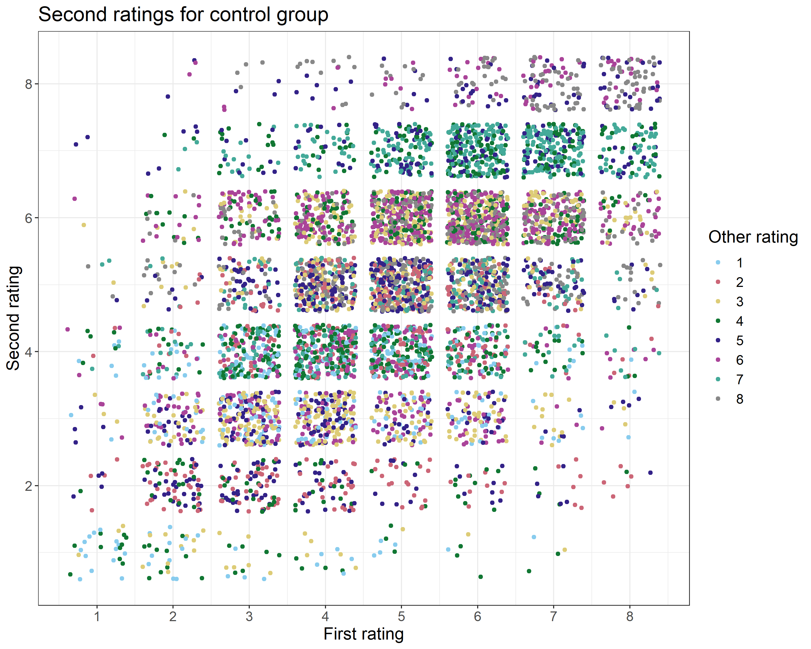

# ACM_assignment3
## Inspecting data
In this assignment, we model the social conformity data. In the task, participants have to rate the trustworthiness of faces on a scale of 1-8. After each rating, they are told what the average rating by the group is (this is an experimental manipulation, that does not actually indicate group rating). After a distraction task, participants have to rate the same faces one the same scale.  

Data from two experiments is available. W chose the patient data, as we found the student data to be messy and buggy. Each row correspond to one trial (one picture) from one participant, and the data includes several columns. The columns of interest to this analysis are:
- FirstRating: the rating given by the participant to the picture in question at _first_ repetition of the experiment
- OtherRating: what the participant is told that the average answer by the rest of the group is
- SecondRating: the rating given by the participant to the picture in question at _second_ repetition of the experiment
- Group: whether the participant is control or clinical group. Has values "control" or "sz" (by our choice)

We then added the columns Feedback (defined as  OtherRating-FirstRating), and Change (defined as SecondRating-FirstRating). The feedback column represent the distance between the perticipant's own choice and what he/she is told is the group choice, while change is represent the change between first and second repetition. 

Furthermore, the data includes columns on reaction times, participant ID, trial number (out of 153) for each of the two repetitions, and ID of the picture shown.  

We found that 1008 rows in the patient data had missing values in the FirstRating. Since this column is important for the analysis, we decided to exclude these rows from the analysis. The missing data came from 7 participant in total, 1 control and 6 clinical patients (NOTE TO SELF: check whether it is always all rows from one participant or whether we exclude just one row from one participant and discuss whether this should be taken into account). In the remaining dataset, data from a total of 76 participants was included. Hereof, 40 were control and 36 were clinical patients. Even though the two groups were therefor not exactly balanced, we still argue that the amount of data available was large enough that the analysis could be conducted. 

Below follows visualizations of the cleaned dataset.

### Histograms
The following figure shows distributions of various interesting variables

All variables seem to be reasonably distributed. There are small changes between the second (top right) and first (top left) rating, and the different ratings have been presented as the group rating a somewhat equal numberof times (bottom right). The feedback is approximately normally distributed with a mean of 0 (bottom left). 

### Model variables
In this analysis, we implement the model SecondRating ~ FirstRating + OtherRating. This is visualized in the plots below, where SecondRating (y-axis) is plotted against the FirstRating (x-axis) and colored by OtherRating. A figure is shown for each of the two groups

There are patterns in the data that suggest mistakes in the experimental setup. For example, it seems that no participants were told the group had rated the trustworthiness as 4 (green) and then gave 3 as their second rating. Likewise, no participants were told the group had rated the trustworthiness as 6 (purple) and then gave 7 as their second rating. This is regardless of what their own first choice was. 

To inspect individual differences, the figures below show the same as the figures above, but with one panel for each participant. 

Here, differences are more easy to detect. We see some participant who generally rate high and only use the top end of the scale, some participants who stick to the middle and never use the extreme ends of the scale, some participant who rate very similar between the two repetitions and some participants who seem to rate very differently between the two repetitions. 

## Analysis
### Models
Simple model: SR ~ logit(FR) + logit(OR)

Weighted model: SR ~ w1 &times; logit(FR) + w2 &times; logit(OR)

### Priors

## Model quality checks

### Markov chains
Below we plot trace plots of the Markov chains for weights and sigma. We do this for both the simple and weighted Bayes.

----insert trace for simple model 

We see that the chains are scattered around a mean and that they seem to converge. This seems to be the case for both weights and sigma. 

### Prior-posterior updates

This figure shows prior-posterior update checks for the four parameters weight 1, weight 2, w1 and w2. The _weight_ parameters are estimated by the model based on the priors we set. The _w_ parameters are passed through the transformation: w = 0.5 + inv_logit(weight)/2. This means that while the _weight_ parameters are what is being estimated, it is actually the _w_ parameters we can interpret. Common to all pp update plots is that the posterior is many times more narrow and certain, even given the relatively uninformative priors. This increases our belief in that the model has been successfully fitted to the data. 

### Prior predictive checks

### Loo stuff

## Results

