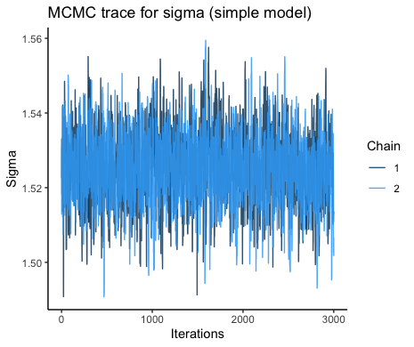
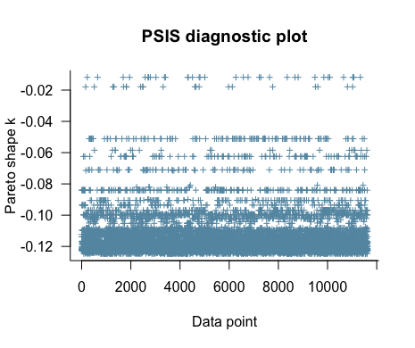
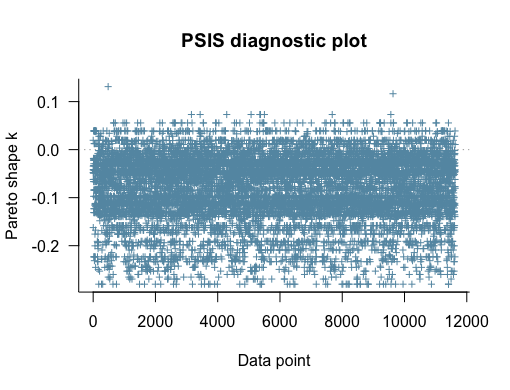

# ACM_assignment3
## Inspecting data
In this assignment, we model the social conformity data. In the task, participants have to rate the trustworthiness of faces on a scale of 1-8. After each rating, they are told what the average rating by the group is (this is an experimental manipulation, that does not actually indicate group rating). After a distraction task, participants have to rate the same faces one the same scale.  

Data from two experiments is available. W chose the patient data, as we found the student data to be messy and buggy. Each row correspond to one trial (one picture) from one participant, and the data includes several columns. The columns of interest to this analysis are:
- FirstRating: the rating given by the participant to the picture in question at _first_ repetition of the experiment
- OtherRating: what the participant is told that the average answer by the rest of the group is
- SecondRating: the rating given by the participant to the picture in question at _second_ repetition of the experiment
- Group: whether the participant is control or clinical group. Has values "control" or "sz" (by our choice)

We then added the columns Feedback (defined as  OtherRating-FirstRating), and Change (defined as SecondRating-FirstRating). The feedback column represent the distance between the perticipant's own choice and what he/she is told is the group choice, while change is represent the change between first and second repetition. 

Furthermore, the data includes columns on reaction times, participant ID, trial number (out of 153) for each of the two repetitions, and ID of the picture shown.  

We found that 1008 rows in the patient data had missing values in the FirstRating. Since this column is important for the analysis, we decided to exclude these rows from the analysis. The missing data came from 7 participant in total, 1 control and 6 clinical patients. In the remaining dataset, data from a total of 76 participants was included. Hereof, 40 were control and 36 were clinical patients. Even though the two groups were therefor not exactly balanced, we still argue that the amount of data available was large enough that the analysis could be conducted. 

Below follows visualizations of the cleaned dataset.

### Histograms
The following figure shows distributions of various interesting variables

All variables seem to be reasonably distributed. There are small changes between the second (top right) and first (top left) rating, and the different ratings have been presented as the group rating a somewhat equal numberof times (bottom right). The feedback is approximately normally distributed with a mean of 0 (bottom left). 

### Model variables
In this analysis, we implement the model SecondRating ~ FirstRating + OtherRating. This is visualized in the plots below, where SecondRating (y-axis) is plotted against the FirstRating (x-axis) and colored by OtherRating. A figure is shown for each of the two groups

There are patterns in the data that suggest mistakes in the experimental setup. For example, it seems that no participants were told the group had rated the trustworthiness as 4 (green) and then gave 3 as their second rating. Likewise, no participants were told the group had rated the trustworthiness as 6 (purple) and then gave 7 as their second rating. This is regardless of what their own first choice was. 

To inspect individual differences, the figures below show the same as the figures above, but with one panel for each participant. 

Here, differences are more easy to detect. We see some participant who generally rate high and only use the top end of the scale, some participants who stick to the middle and never use the extreme ends of the scale, some participant who rate very similar between the two repetitions and some participants who seem to rate very differently between the two repetitions. 

## Analysis
### Models
We tested two different Bayesian models. First, we do a simple model in which the only parameter to estimate is the error, i.e. sigma. Then, we do a more complex model in which we estimate weights for FirstRating and OtherRating along with sigma. 

Simple model: 

%20&plus;%20logit(OR)%20&plus;%20%5Csigma)

Weighted model: 

%20&plus;%20w_2%20%5Ccdot%20logit(OR)%20&plus;%20%5Csigma)

These models were run using 2 parallel chains with 2 threads per chain, 1500 warmup iterations and 3000 sampling iterations. We used a maximum treedepth of 20 and an adapt delta of 0.99. 

### Priors
For sigma, we used a normally distributed prior with a mean of 0.3 and a SD of 0.15 with a lower boundary of 0. When setting normally distributed priors, it can be common practice to use the standard deviation of the data as the mean and half of that as the SD. However, as the standard deviation of the data in this case is around 0.1, this would lead to a very narrow/certain prior, and therefore we chose to use a slightly more conservative prior.   
For the weights, we used normally distributed priors centered around 0 with a SD of 1. 

## Model quality checks

### Markov chains
Below we visualise trace plots of the Markov chains.

For the simple Bayes, we plot sigma:  

And for the weighted Bayes, we plot sigma along with both weights:

We see that the chains are scattered around a mean and that they seem to converge. This seems to be the case for both weights and sigma. 

### Prior-posterior updates

This figure shows prior-posterior update checks for the four parameters weight 1, weight 2, w1 and w2. The _weight_ parameters are estimated by the model based on the priors we set. The _w_ parameters are passed through the transformation: w = 0.5 + inv_logit(weight)/2. This means that while the _weight_ parameters are what is being estimated, it is actually the _w_ parameters we can interpret. Common to all pp update plots is that the posterior is many times more narrow and certain, even given the relatively uninformative priors. This increases our belief in that the model has been successfully fitted to the data. 

### PSIS diagnostics
Below we visualise Pareto smoothed importance sample (PSIS) diagnostic plots for both models to inspect the Pareto _k_ estimates for each data point.

Simple:  

  
Weighted:  

We see that all data points have a Pareto _k_ < 0.5.  For the weighted Bayes, we see two data points slightly above the distribution the rest, however, they are still relatively close and not near 0.5. We therefore interpret these results as not indicating extreme values that would influence the model to an extent that we should worry about. 

## Results
Using the loo_compare() and loo_model_weights() functions from the [loo](https://www.rdocumentation.org/packages/loo/versions/2.4.1)-package, we extract the estimated difference in expected predictive accuracy (elpd-diff) along with their weights:

| model | elpd_diff | se_diff | 
|--- |--- | --- |
simple Bayes | 0.0 | 0.0 |
weighted Bayes | -24669.1 | 121.5 |

| model | weight |  
| --- | --- | 
simple Bayes | 0.0 |
weighted Bayes | 1.0 | 

Upon comparing the two models, we see that the weighte dBayes is the preferred model. The elpd difference between the two models is above 4 and has a relatively small difference in standard error. These results indicate that the expected predictive accuracy is higher for the weighted Bayes model and speak in favor of using the weighted Bayes model over simple Bayes to model the behaviour of the participants in this dataset. 

